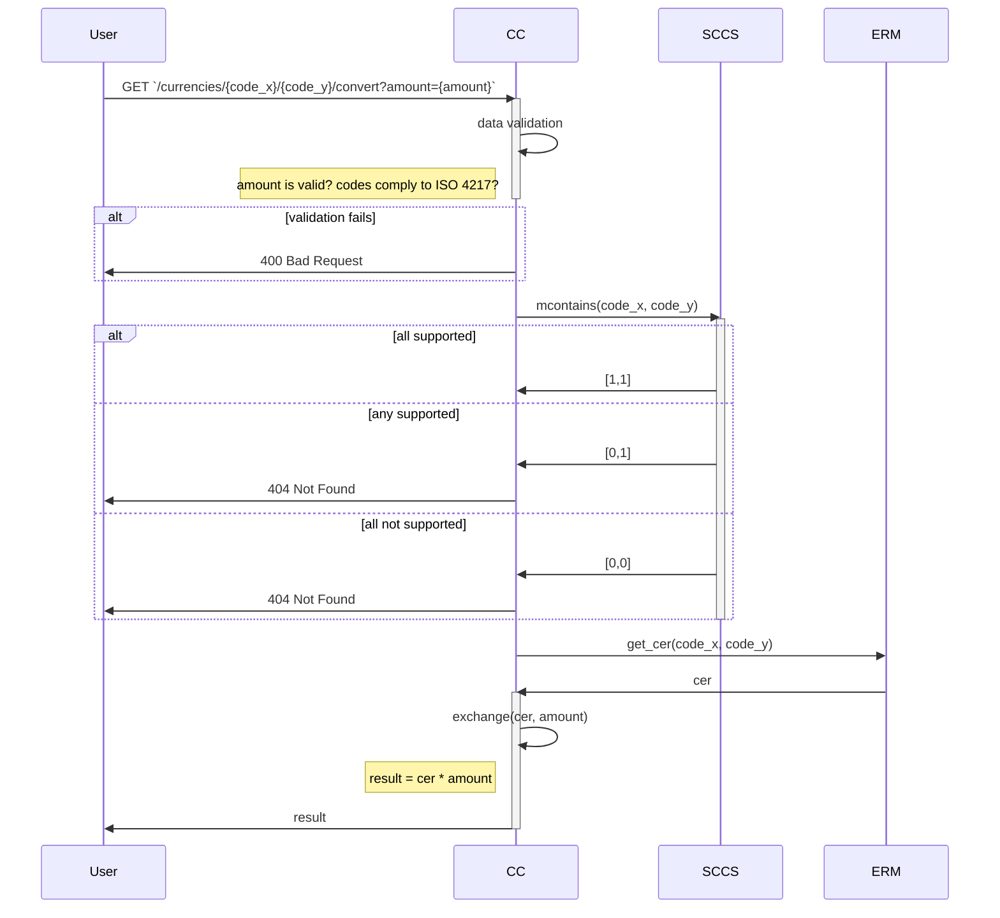

# REST web service for currency conversion

* Build pre-commit hooks: `black`, `isort`, `mypy`, `Dockerfile Line` and `YAMLLint`
* Monitoring metrics: 
  * TODO

## Requirements
* Exchange rates updated from web-resources once a day
* Initially supported currencies : Czech koruna, Euro, Polish złoty and US dollar, but can be extended
* Speed of conversion is important

## Components

### Exchange Rates Map (ERM)
Allows fast retrieval of exchange rate for a given pair of currency codes.

* Highly available
* Read frequently
* Updated at least once a day

#### Interface
* `get_cer(code_x: str, code_y: str) -> float`
* `update_cer(code_x: str, code_y: str) -> None`

#### Storing strategy
`ERM` should be fast to read and highly available. Storing `ERM` in memory will be fast to read, 
but if server fails we'll need to update `ERM` once again and that might be expensive. 
Since that, we might consider some persistable in-memory storage, e.g **Redis**. 

#### Exchange rates update
`ERM` is basically a map of permutations of all values in `SCC` to corresponent exchange rates.

Each exchange rate is retrieved from resource and updated in ERM.
As soon as each `CER` (Currency Exchange Rate) can be updated independently this operation 
might be performed asynchronously, utilizing a **task queue**.

### Supported Currency Codes Set (SCCS)
Allows fast retrieval of currency codes available for exchange.

* Highly available
* Read frequently
* Updated on demand, but potentially very rarely.

### Currency Converter (CC)
Converts given amount of supported currency X to correspondent amount of supported currency Y, using
exchange rate of (X,Y). Provides web-api for converting operations.

* Highly available
* Read frequently

#### Interface
* `exchange(exchange_rate: float, amount: float) -> float`

## WEB-API
To allow greater scalability no state should be stored in API component. 
* GET `/currencies/{code}/{code}/convert?n={n}`